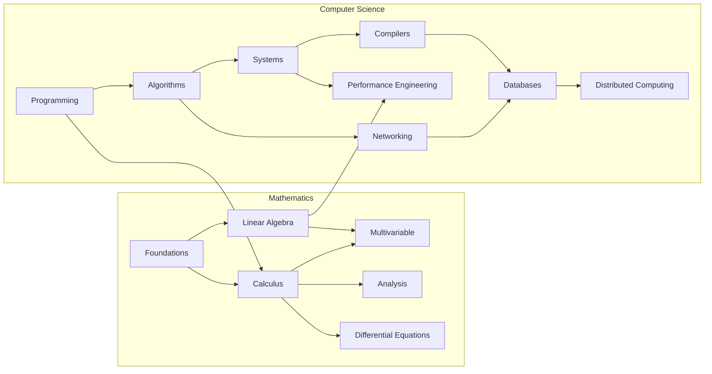

Curriculum Plan for topics in undergraduate mathematics and computer science. I plan on using the General Study Plan as a guideline. 

## Mathematics

### Foundations

- ~~MAF1: Art of Problem Solving I~~
- ~~MAF2: Discrete Mathematics and Functional Programming~~
- MAF1: OpenStax Pre-Calculus 
- MAF2: Precalculus - Stitz/Zeager 
- MAF3: Basic Mathematics - Serge Lang
- MAF4: Trigonometry - Michel Corral
- MAF5: Discrete Mathematics with Applications - Epp
- MAF6: Discrete Mathematics - Johsonbaugh

### Calculus

- MAC1: Apostol Calculus Vol I
- MAC2: The Calculus Integral
- MAC3: Introduction to Calculus and Analysis Vol 1. - Courant

### Linear Algebra

- MALA1: Coding the Matrix
- MALA2: Linear Algebra Done Right
- MALA3: Introduction to Linear Algebra (MIT)* 
- MALA4: Linear Algebra Done Wrong
- MALA5: Linear Algebra - Friedman, Insel, and Spence

### Multivariable

- MAMV1: OCW - Multivariable Calculus
- MAMV2: Apostol Calculus Vol 2
- MAMV3: Introduction to Calculus and Analysis Vol 2. - Courant 

### Differential Equations

- MADQ1: OCW - Computational Science and Engineering
- MADQ2: Ordinary Differential Equations (Dover)

### Analysis

- MAA1: Understanding Analysis, Abbott
- MAA2: Principles of Mathematical Analysis (Baby Rudin)

### Number Theory

- MAN1: Elementary Number Theory
- MAN2: Number Theory (Dover)

## Computer Science

### Programming

- CSP1: Principles of Functional Programming (COMP 212)
- CSP2: Functional Programming and Data Structures (CS3110)
- CSP3: How to Design Programs

### Systems

- CSS1: Computer Systems, a Programmer's Perspective
- CSS2: Computer Organization and Design (RISC-V)
- CSS3: Operating Systems Engineering (MIT)
- CSS4: Operating Systems: 3 easy pieces

### Compilers

- CSC1: CSE131 - Compilers
- CSC2: Crafting Interpreters
- CSC3: Dragon Book*

### Databases

- CSDB1: Database Systems - CMU 15-445
- CSDB2: Readings in Database Systems
- CSDB3: Advanced Database Systems - CMU 15-721

### Algorithms

- CSA1: Introduction to Parallel and Sequential Algorithms
- CSA2: Advanced Data Structures - MIT 6.851
- CSA3: Functional Data Structures
- CSA4: Purely Functional Data Structures

### Networking

- CSN1: Computer Networking: A Top-Down Approach
- CSN2: Data Structures and Network Algorithms

### Distributed Systems

- CSD1: Designing Data-Intensive Applications

## General Study Plan

