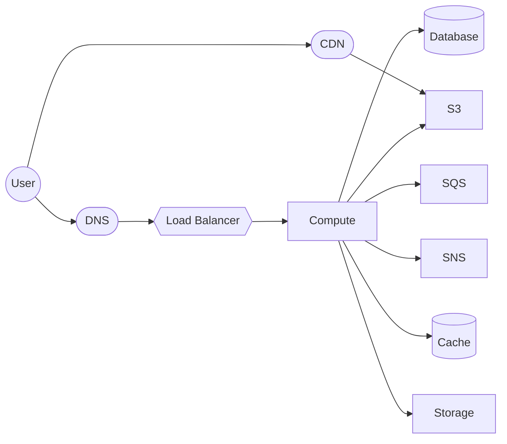
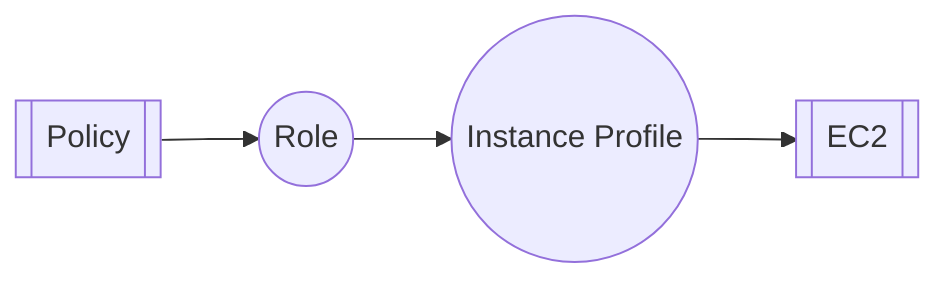
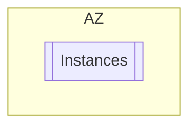
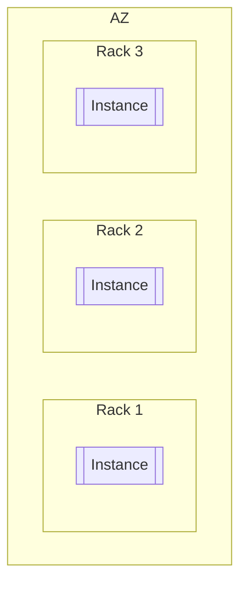
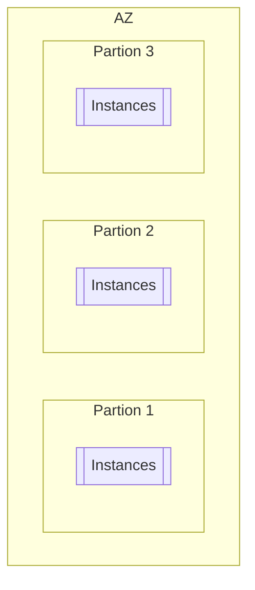

In AWS, raw compute resources are provided by the **Elastic Cloud Compute** or **EC2** service which provides re-sizable virtual machine resources.

> [!tip]
> EC2 Metadata can be accessed by querying **169.254.169.254**

## General Properties

The following should be considered when provisioning compute resources from EC2.

### Instance Profile

An instance profile is an [[IAM]] role attached to an EC2 instance. This enables RBAC over the actions a machine is allowed to perform.

### Instance Families

Instance families refer to specific architecture designed to optimize computing for a particular domain (e.g graphics):

- R(am): Applications that require a lot of memory
- C(PU): Applications requiring lots of computing power
- M(edium): General purpose computing
- I(/0): IO-heavy applications (databases)
- T2/T3: Burstable, average performance characteristics

#### Graviton

AWS proprietary processors. Best price performance.

- Supports most Linux/Unix-base OSs
- No support for Windows
- Graviton2: Up to 40% price performance improvements
- Graviton3: Up to 3x improvement over Graviton2

### Launch Types

Instance types dramatically affect the price and reliability of computing resources

- On-Demand: EC2 provisioned upon request
	- No long-term contract
	- Good for workloads that need reliable compute
- Savings Plan: Cost reduction in exchange for commitment to consistent usage
	- 1-3 year offerings
	- Compute Savings plans apply to EC2, [[Lambda]], and [[Elastic Cloud Compute#Fargate]]
- Spot Instances: Run workloads on unused EC2 resources
	- Less reliable, may be reclaimed at any point
	- Good for stateless workloads
	- Greatest potential for cost savings

### Placement Groups

These control the logical distribution or locality of provisioned EC2 instances.

#### Cluster

Instances packed **closely** inside the AZ

- Low-latency
- Good for [[High Performance Computing]]
- Not available for Multi-AZ

#### Spread

Each instance is provisioned on separate underlying hardware

- Max 7 instances/group/AZ
- Good for high fault-tolerance

#### Partition

Spreads instances across logical **partitions**

- Groups do not share underlying hardware
- Typically used for Hadoop, Cassandra etc. workloads

Instances can be moved in and out of placement groups (must be stopped first).
