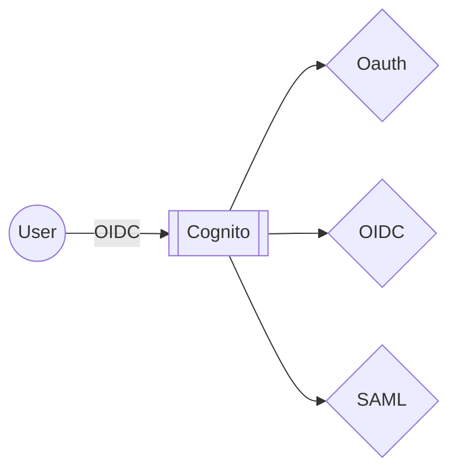
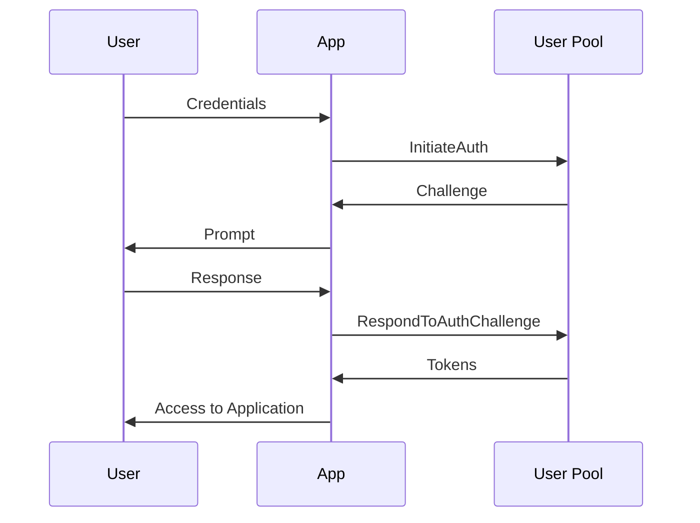

Amazon Cognito provides ODIC Identity Providers (IdP) in the form of Cognito User Pools.

## Rate Limits

## User Pools

User pools act an an OIDC identity provider. Pools provide both federated and direct login access to users.

- Issues user attributes in a JWT
- Can be configured to handle interaction with 3rd party IdPs

### Authentication

Cognito provides several mechanisms for authentication. Generally these involve invoking specific APIs and/or responding to authentication challenges.

#### Normal Authentication

The following sequence is used for **client-side** authentication flows:

1. `InitiateAuth`
2. `RespondToAuthChallenge`

## Identity Pools

## Security

## Common Scenarios