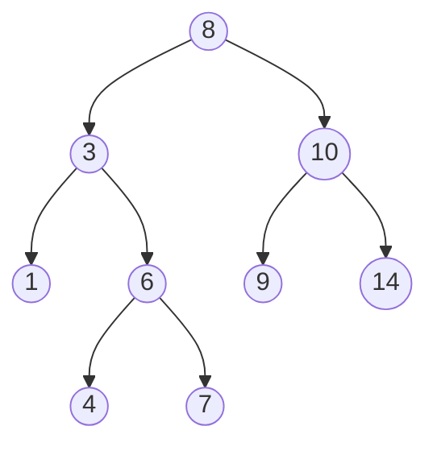
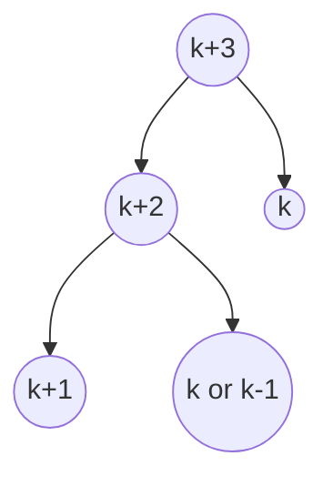
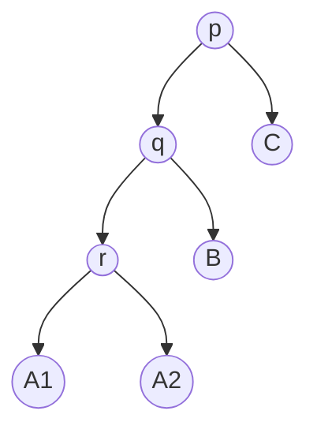
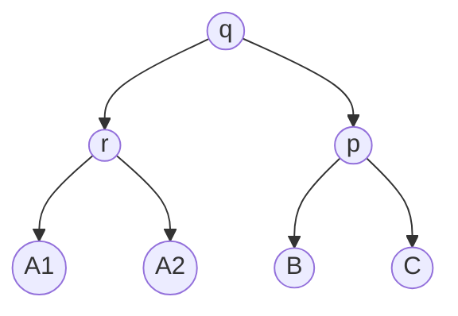
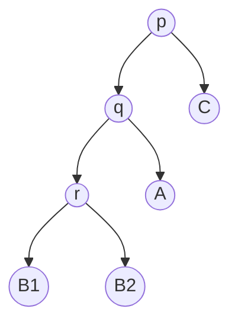
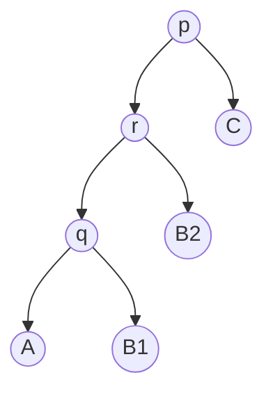

We examine a few options (and tradeoffs) between various underlying data structures chosen to represent a "set".

## Sets as Lists

We want to satisfying the following interface:

```
Set
	size :: (Set<T>) -> Number
	empty :: Set
	is-in :: (T, Set<T>) -> Bool
	union :: (Set<T>, Set<T>) -> Set<T>
	insert :: (T, Set<T>) -> Set<T>
	to-list :: (Set<T> -> List<T>)
```

A key decision to make here is whether we allow the storage of duplicates.

| Duplicates | size    | insert | is-in |
| ---------- | ------- | ------ | ----- |
| N          | O(n)    | O(n)   | O(n)  |
| Y          | $O(n^2)$ | O(1)   | O(n)  |

We see the hefty quadratic price of size due to the need to check whether we should count each element:

```python
def size(s):
	if not s:
		return 0

	h, t = s[0], s[1:]

	if h in t:
		return size(t)

	return 1 + size(t)
```

Depending on our access patterns, this may not be a huge deal, but we can choose alternative (more complex) representations in order to achieve better results.

## Sets as a Tree

The biggest draw back of not storing duplicates was the across-the-board linear operations. We can devise a way to cheapen some operations by "discarding" more than a constant number of inputs per iteration.

### Binary Search Tree

Suppose we do some bookkeeping on a structure such that we can ignore half the elements at each decision point:



We see that in the above construction, called a Binary Search Tree (BST), each element in a node's left subtree is less (or $\leqslant$) to the value at that node and the converse for the right subtree.

> [!warning] Critical Flaw
> With a naive implementation, a BST has the potential to degrade into $O(n)$ search. Consider the following sequence of insertions:
> ```python
> t = Tree()
> insert(1, t)
> insert(2, t)
> # ...
> insert(k, t)
>```
> This would produce a tree that is skewed to the right:
> ```mermaid
> graph LR
> A((1))-->B((2))
> B((2))-->C((3))
> C((3))-->D((4))
> ```
> Requiring a linear search for membership.

## Self-Balancing Trees

Rectifying the inherent flaw in BSTs requires some additional bookkeeping. We want to introduce the notion of a "balanced" tree such that we can guarantee logarithmic complexity of operations in the worst case.

> [!info] Balanced BST
> Let $T$ be a binary tree. For each node, we let $B = height(L) - height(R)$ (called the **balance factor**) where $L$ and $R$ are the left and right subtrees of a node. We say $T$ is **balanced** if and only if $|B| \leqslant 1$ for all nodes in $T$.

### Basic Tools

This section provides some implementations of the building blocks required to test for the Binary Search Tree and Balanced invariants.

#### Height

```python
def height(t):
	'''
	height(t) computes the longest path from the root of [t] to a leaf.

	Parameters:
		t (BinaryTree): A non-empty binary tree

	Output:
		The height of [t]
	'''
	if isLeaf(t):
		return 1

	return max(1 + height(t.l), 1 + height(t.r))
```

#### BST Invariant

```python
# NOTE: Normally we assume implementations of min and max. The following checks each node for correctness without finding these absolutes.
def isBST(t):
	'''
	isBTS(t) is whether [t] satisfies the binary search tree invariant
	'''
	# Whether [x] is <= every node in [n]
	def lte(x, n):
		if isLeaf(n):
			return true

		return x <= n.v and lte(x, n.l) and lte(x, n.r)

	# Whether [x] is >= every node in [n]
	def gte(x, n):
		if isLeaf(n):
			return true

		return x >= n.v and gte(x, n.l) and gte(x, n.r)

	return (isLeaf(n.l) or gte(x, n.l)) and
		   (isLeaf(n.r) or lte(x, n.r)) and
			isBST(n.l) or isBST(n.r)
```

#### Balanced Invariant

```python
def isBalanced(t):
	'''
	isBalanced computes whether [t] is a balanced BST. In particular,
	whether the number of nodes along a left subtree in [t] exceeds that of
	the corresponding rightsubtree by more than 1.

	Parameters:
		t (Binary Search Tree): A non-empty Binary Search Tree

	Output:
		Whether [t] is balanced.
	'''

	if isLeaf(t):
		return True

	return abs(height(t.l) - height(t.r) <= 1) and
			isBalanced(t.l) and
			isBalanced(t.r)
```

### AVL Tree

**A**ddison-**Velsky** and **L**andis tree. This structure defines a mechanism for re-balancing its subtrees on insert and delete.

> [!note]
> In comparison to a Red-Black tree, an AVL tree is "more strictly" balanced, making it somewhat more suitable for read-heavy operations.


A few keys points:

- Insertions can only ever create a balance factor of $\pm 2$
- The "problem" subtree will have height $k+1$ and the other will have height $k$ or $k-1$.

#### Left-Left Scenario

Suppose inserting into a tree results in the following (heights of each subtree labeled):



> Imbalanced Tree

Then one of the subtrees of the $k+1$ tree has height $k$ and the other is $k-1$. The situation is illustrated below:



If we suppose $h(A_1) = k$, then $h(A_2) = k - 1$

We "rotate" the subtrees clockwise to achieve:



#### Left-Right Scenario

If instead we suppose $B$ has a height of $k$, then the issue lies with one of the subtrees of $B$. Again



> [!note]
> Mermaid screwed up the left and right subtree ordering in the above example

The solution here is to elevate $B_2$ and swap $q$ with $r$ as an intermediate step:



Here, we reduce the problem into the previous Left-Left scenario under subtree `q`, and so we can proceed with the corresponding rotation.