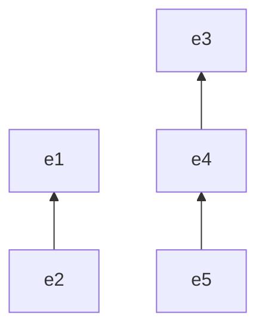
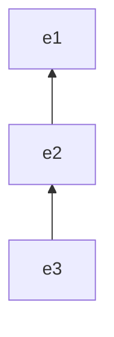
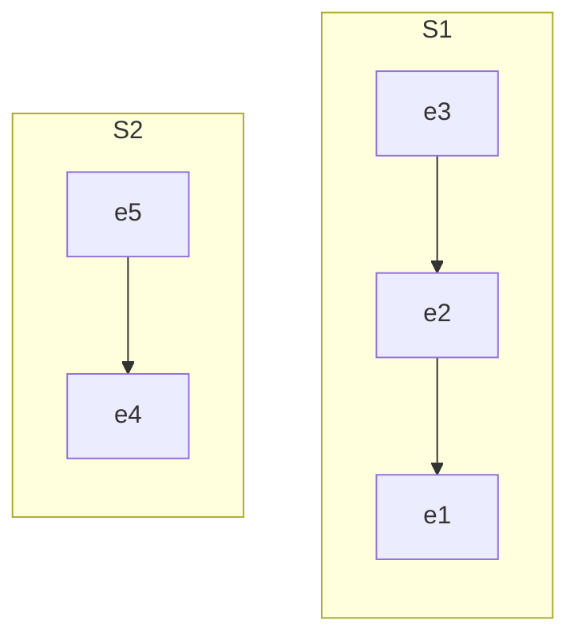
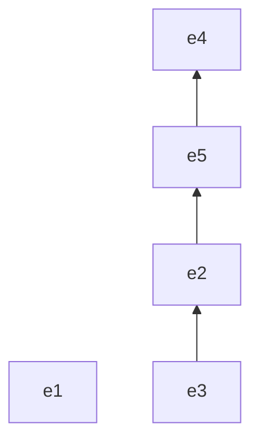

A critical optimization of [[Spanning Tree#Borůvka's Algorithm]] is an efficient mechanism to determine the connectedness of disjoint components. We could repeatedly perform graph traversals, but this would be $O(N + E)$ for each pair of nodes!

## Disjoint Set

We begin by reconsidering the problem of "connectivity" as "membership" of the same set. Each component in the solution starts off as singleton of a node (hence a partition, hence disjointedness). The operations of the **Disjoint Set** data structure naturally follow from our requirements of:
- Testing Membership (Find)
- Merging two sets (Union)

Thus, this data structure is often referred to as a **Union Find**.

## Union Find



We choose to let one "representative element" indicate the identity of the set and use it to test for membership:

We assume the following representation of element:

```
Element
	e: Val
	parent: Element
```

### Find



Given element `e3`, we find its "earliest ancestor" `e1`

```python
# Pseudocode for general Union-Find operations

def find(e, S):
	'''
	find tests [e] for membership in some subset of [S]

	Parameters:
		e (T): An arbitrary element in some set of S
		S (list): A list containing all the sets of interest. 

	Output:
		The set in [S] to which [e] belongs.
	'''
	if not S:
		raise "Unreachable"

	h, t = S[0], S[1:]

	# If we find a match for e, check for a parent that may lead to a "predecesor" set
	if e == h:
		if not h.parent:
			return h

		# Search for the set to which the parent belongs
		return find(h.parent, S)

	return find(e, t)
```

Thus to compute whether two elements are in the same set:

```python
def sameSet(e1, e2, S):
	'''
	sameSet computes whether e1 and e2 belong to the same set

	Parameters:
		e1, e2 (T): Arbitrary elements of S1, S2 in S
		S (list): The collection of all sets

	Output:
		Whether e1 and e2 belong to the same set.
	'''
	return find(e1, S) == find(e2, S)
```

### Union





In the above diagram, we have chosen to merge `e2` and `e5`. Producing a union in which the parent of `e2` is `e5`.

We merge two sets, arbitrarily choosing one to represent the new set and assigning the same parent to both:

```python
def merge(e1, e2):
	'''
	merge(e1, e2) updates [e1]'s parent to reference [e2].

	Parameters:
		e1, e2 (Set): Arbitrary sets to be merged

	Output:
		A set with elements of [e1] and parent of [e2]
	'''
	e1.parent = e2

def union(e1, e2):
	'''
	union produces the union of the sets of [e1] and [e2].

	Parameters:
		e1, e2 (Element): Elements of arbitrary sets s1, s2.
	'''

	s1 = find(e1)
	s2 = find(e2)

	if s1 == s2:
		return s1

	return merge(s1, s2)
```

#### Optimization

> [!tip] Path Compression
> This critical tweak is responsible for the absurdly good average runtime of a union find.

During the find procedure, we can perform some bookkeeping to improve the performance of future find operations:

```python
def find(e):
	'''
	find(e) returns the parent of [e1].

	Parameters:
		e (Element): An element of some arbitrary set

	Output:
		The parent element of e.

	Notes:
		As an optimization, elements along the path from e1 to its parent
		are also updated to point to the common ancestor element, thereby
		reducing the cost of future lookups to constant for each.
	'''
	if not e.parent:
		return e

	p = e.parent
	gp = find(p)

	e.parent = gp

	return gp
```

> [!todo]
> Diagram