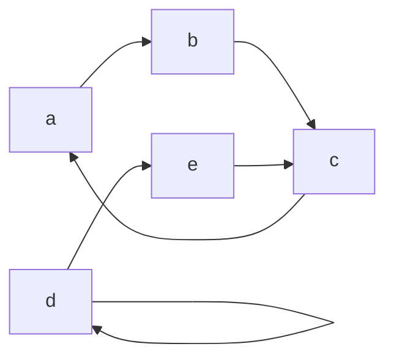
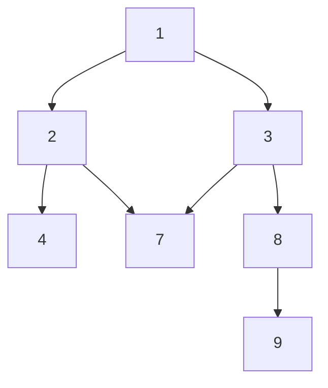
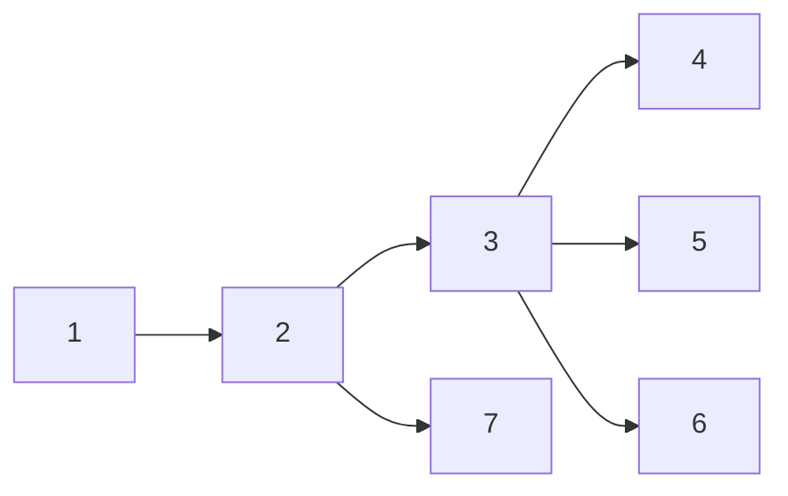
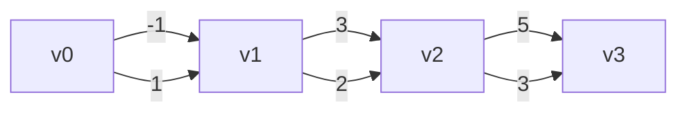

We start out with the basic definition of a graph inasmuch as is helpful for basic analysis of graph algorithms. See [[Graph Theory]] for a more rigorous treatment.

## Graph



We can consider a graph a set of vertices and edges. The particular representation of a graph has implications with respect to the analysis of algorithms, but broadly speaking we want to consider the inputs as both edges and vertices.

> [!info] Graph
> A graph $G$ is a structure with a set of **vertices** $V = \{ v_0, v_1, \dots, v_n \}$ and **edges** $E = \{ e_0, e_1, \dots e_n \}$. We represent a **path** in G by a sequence of alternating vertices and edges: $v_0 e_0 v_1 e_1 v_2 \dots e_{n-1} v_n$.

## Representing a Graph

We start off by using an **adjacency list** to represent a graph $G$. An **adjacency list** contains all vertices of $G$ as well as the nodes with which they share a connection.

> [!info] Adjacent
> Let $v_0, v_1 \in V$ and and let $G = V, E$. We say $v_0, v_1$ are **adjacent** if there exists an edge between them. 

```python
# Adjacency list representation of a graph
graph = [
	{ key: 'A', adj: [ 'B', 'C' ]},
	{ key: 'B', adj: [ 'D' ] },
	{ key: 'C', adj: [] },
	{ key: 'D', adj: [] }
]
```

> [!warning]
> It is important to understand whether an adjacency list represents a directed graph or not!

## Basic Graph Traversals

Traversing a graph allows important questions such as whether a node is reachable from another and the shortest (lightest) path. Depth-first is the more straightforward to implement (and also may perform better), while breadth-first allows us to consider the optimality of a traversal.

> [!warning]
> In either strategy, it is important to keep track of previously visited nodes in order to detect cycles!

### Depth-First



> An example depth-first traversal of the above graph:  1, 2, 4, 7, 3, 8, 9

Depth-first traversal of a graph traverse a neighbor immediately before considering other neighbors. 

The following program computes whether a `dst` is reachable from `src` using a depth-first traversal.

```python
# Assume adjacency list representation
def reachable(src, dst, g):
	'''
	reachable computes whether there is a path in [g] from [src] to [dst].

	Parameters:
		src, dst (string): Keys corresponding to nodes in [g]
		g (node[]): An adjacency list representing a graph

	Output:
		Whether [dst] was reached starting from [src].
	'''
	def traverse(k, visited):
		if k in visited:
			return false
		elif k == dst:
			return true
		else:
			for n in findNode(k, g):
				traverse(n, [k] + visited)

	traverse(src, [])
```

### Breadth-First



> An example breadth-first traversal of the above graph: 1, 2, 7, 3, 4, 5, 6

Breadth-first traversals consider all neighbors of a node before traversing each. This is usually accomplished by enqueuing  a node's neighbors in a data-structure before dequeueing them one at a time for processing.

```python
# Assume implementation of Queue, and Adj list representation of Graph
def breadthFirst(g):
	'''
	breadthFirst performs a breadth-first traversal of g starting at an
	arbitrary node (such as the first in the adjacency list).

	Parameters:
		g (node[]): An adjacency list representation of a graph
	'''
	def traverse(queue, visited):
		if queue.empty():
			return 
			
		n = findNode(q.dequeue())

		print(n)

		if n in visited:
			return

		for edge in n.edges:
			q.enqueue(edge)

		traverse(q, [n] + visited)

	q = Queue()

	traverse(q.enqueue(g[0]), [])
```

> [!tip]
> The cost of Breadth-First is usually higher than that of Depth-First due to the overhead of maintaining the queue/other data structure.

## Weighted Edges

Finally, in most real scenarios there is a positive "cost" of traversing a particular edge. We model this by assigning a "weight" to such an edge. For some classic graph algorithms (Dijkstra's), it is important that the weight of an edge is greater than zero.



The graph shown above has a "true" shortest path consisting of edges with weights $1, 2, 3$, but the introduction of negative weights along the path result in the incorrect output of greedy algorithms: $-1, 3, 5$.

> [!note] "Shortest" Path
> Usually when we refer to the "shortest" path, we _actually_ mean the "lightest" path. That is, the path containing the minimal sum of edge weights.