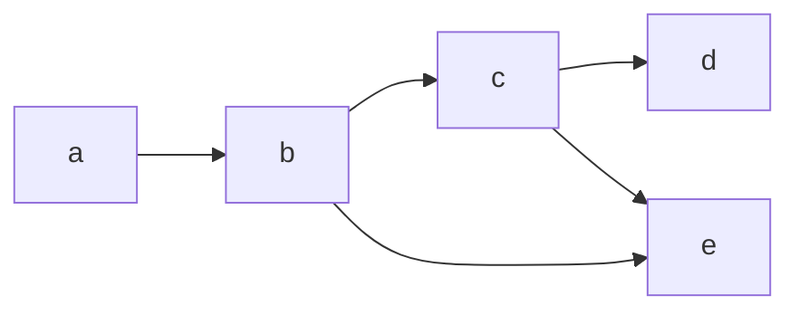

Mathematically a graph is represented by a pair of sets, $V, E$ corresponding to its vertices and edges.



The above graph would be denoted $G = (V, E)$ where $V = \{ a, b, c, d, e \}$ and $E = \{ (a, b), (b, c), (b, e), (c, d), (c, e) \}$. Where $(u, v) \in E$ are considered **ordered** if the graph is **directed**.

> [!info] Graph Terminology
> The following are common terms when describing a graph.
>
> **Path**: A sequence of vertices $u_1, u_2, \dots, u_k$ such that every $(u_k, u_{k+1})$ is an edge in $E$
>
> **Simple**: A simple **path** is one in which all vertices are distinct.
>
> **Cycle**: A path $v_1, \dots, v_k$ where the first $k-1$ vertices are distinct and the $k$th vertex is equal to the first.
>
> ```mermaid
> graph LR
> a---b
> b---c
> c---d
> d---a
> ```
>
> **Connected**: A graph is connected if for every $u, v \in V$, $(u, v) \in E$. A directed graph is called **strongly connected** if all vertices are **mutually reachable**
>
> **Distance**: The **minimum** number of edges between two vertices.

A common special case of a graph is called a **tree**, which has the following properties:

> [!info] Tree
> A tree is a connected graph that contains no cycles.
> ```mermaid
> graph TD
> a---b
> a---c
> b---d
> c---e
> c---f
> c---g
> ```

> [!todo]
> Prove some basic theorems about graphs. (See Epp)
