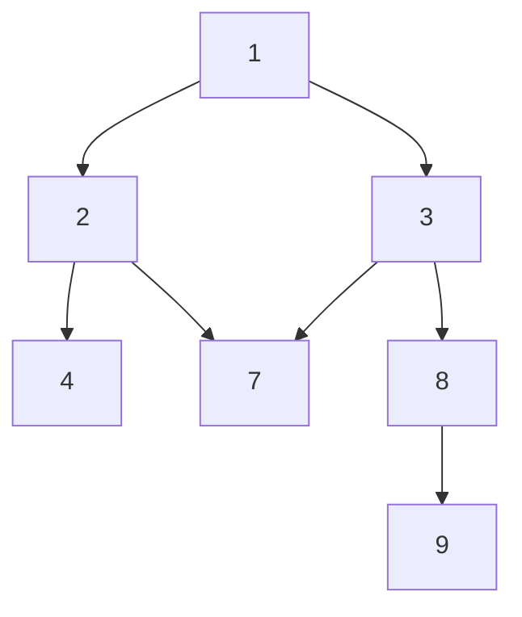
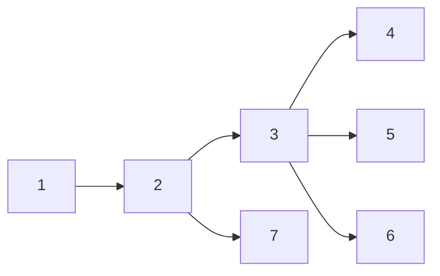
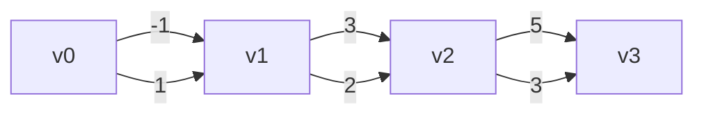

## Representing a Graph

We start off by using an **adjacency list** to represent a graph $G$. An **adjacency list** contains all vertices of $G$ as well as the nodes with which they share a connection.

> [!info] Adjacent
> Let $v_0, v_1 \in V$ and and let $G = V, E$. We say $v_0, v_1$ are **adjacent** if there exists an edge between them.

There are two main ways to represent a graph, an **adjacency matrix** and **adjacency list**. For most purposes, the **adjacency list** representation will be used.

> [!info] Adjacency Matrix
> Assume $G = (V, E)$ and let $n = |V|$. An **adjacency matrix**, $A$ is an $n \times n$ matrix in which each entry $A_{u,v}$ corresponds to whether there is an edge $(u, v) \in E$. For undirected graphs, $A$ is symmetrical.
>
> ```mermaid
> graph LR
>	a---b
>	a---c
>	c---b
>	b---d
>	d---e
> ```
> This graph is represented by the following matrix:
> $$
> \begin{array}{c c}
> & \begin{array}{c c c} a & b & c & d & e \\ \end{array} \\
> \begin{array}{c c c}a \\ b \\ c \\ d \\ e \end{array} &
> \left[
> \begin{array}{c c c}
> 0 & 1 & 1 & 0 & 0 \\
> 1 & 0 & 1 & 1 & 0 \\
> 1 & 1 & 0 & 0 & 0 \\
> 0 & 1 & 0 & 0 & 1 \\
> 0 & 0 & 0 & 1 & 0
> \end{array}
> \right]
> \end{array}
> $$

An adjacency matrix uses $O(n^2)$ space regardless of the number of edges between vertices, often wasting space.

> [!info] Adjacency List
> Assume $G = (V, E)$ and let $n = |V|, m = |E|$. An **adjacency list** is a mapping from a node to its incident edges.
>
> ```mermaid
> graph LR
>	a---b
>	a---c
>	c---b
>	b---d
>	d---e
> ```
>
> Is represented by:
>
> ```python
> {
> 	'a': [b, c],
> 	'b': [a, c, d],
> 	'c': [a, b],
> 	'd': [b, e],
> 	'e': [b]
> }
> ```

## Depth-First Search



> An example depth-first traversal of the above graph:  1, 2, 4, 7, 3, 8, 9

Depth-first traversal of a graph traverse a neighbor immediately before considering other neighbors.

The following program computes whether a `dst` is reachable from `src` using a depth-first traversal.

```python
# Assume adjacency list representation
def reachable(src, dst, g):
	'''
	reachable computes whether there is a path in [g] from [src] to [dst].

	Parameters:
		src, dst (string): Keys corresponding to nodes in [g]
		g (node[]): An adjacency list representing a graph

	Output:
		Whether [dst] was reached starting from [src].
	'''
	def dfs(k, visited):
		visited[k] = True
		if k == dst:
			return True

		for v in g[k]:
			if v not in visited:
				if dfs(k, visited):
					return True

		return False

	return dfs(src, {})

```

### Breadth-First



> An example breadth-first traversal of the above graph: 1, 2, 7, 3, 4, 5, 6

Breadth-first traversals consider all neighbors of a node before traversing each. This is usually accomplished by enqueuing  a node's neighbors in a data-structure before dequeueing them one at a time for processing.

```python
# Assume implementation of Queue, and Adj list representation of Graph
def breadthFirst(g):
	'''
	breadthFirst performs a breadth-first traversal of g starting at an
	arbitrary node (such as the first in the adjacency list).

	Parameters:
		g (node[]): An adjacency list representation of a graph
	'''
	def bfs(G, start):
		visited = {start: True}
		queue = [start]

		while queue:
			u = queue.dequeue()

			for v in G[u]:
				if v not in visited:
					visited[v] = True
					queue.enqueue(v)
```

> [!tip]
> The cost of Breadth-First is usually higher than that of Depth-First due to the overhead of maintaining the queue/other data structure.

#### Analysis

We show that the runtime of BFS is linear with respect to the number of nodes $n$ and number of edges $m$. We also assume the **adjacency list** representation of a graph.

```
BFS(G, start)
	visited[s] = True
	enqueue(s)
	while Q not empty
		u = dequeue()

		for v in adj[u]:
			if v not in visited:
				visited[v] = True
				enqueue(v)
```

The linear runtime follows from examination of the inner loop, assuming other operations run in constant time. For each iteration, we have `1 + deg(u)` (since `deg(u) = |adj[u]|`), hence we arrive at the following summation:

$$
\begin{align}
\sum_{k=1}^n 1 + \deg(k) &= \sum_{k=1}^n 1 + \sum_{k=1}^n \deg(k) = n + 2m
\end{align}
$$

Thus we conclude the runtime of BFS is $O(n + m)$

## Weighted Edges

Finally, in most real scenarios there is a positive "cost" of traversing a particular edge. We model this by assigning a "weight" to such an edge. For some classic graph algorithms (Dijkstra's), it is important that the weight of an edge is greater than zero.



The graph shown above has a "true" shortest path consisting of edges with weights $1, 2, 3$, but the introduction of negative weights along the path result in the incorrect output of greedy algorithms: $-1, 3, 5$.

> [!note] "Shortest" Path
> Usually when we refer to the "shortest" path, we _actually_ mean the "lightest" path. That is, the path containing the minimal sum of edge weights.