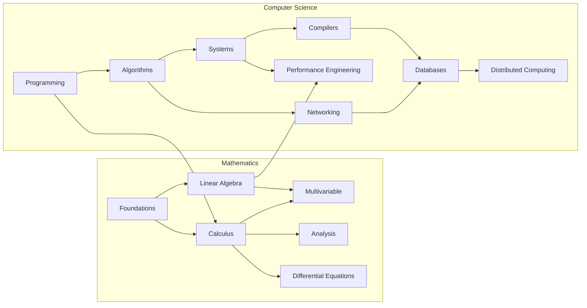
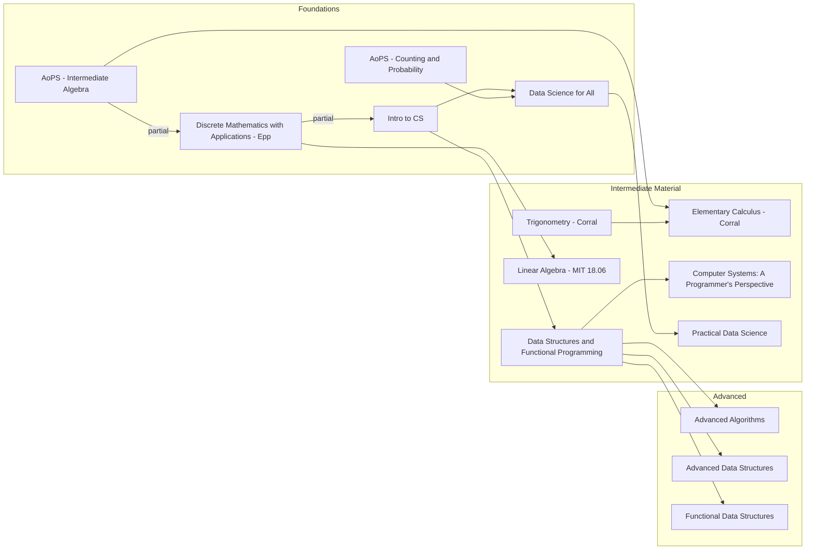

Curriculum Plan for topics in undergraduate mathematics and computer science. I plan on using the General Study Plan as a guideline. 

## Mathematics

### Foundations

- MAF1: Algebra - I.M Gelfand
- MAF2: Algebra and Trigonometry - Axler
- MAF3: Precalculus: A Prelude to Calculus - Axler 
- MAF4: OpenStax Pre-Calculus
- MAF5: Precalculus with Unit Circle Trig. Cohen
- MAF6: Precalculus - Stitz/Zeager 
- MAF7: Basic Mathematics - Serge Lang
- MAF8: Trigonometry - Michel Corral
- MAF9: Discrete Mathematics with Applications - Epp
- MAF10: Discrete Mathematics - Johsonbaugh
- MAF11: (Optional) Logic and Proof

> Not listed here (due to expense) is the Art of Problem Solving series, which remains the absolute best resource on pre-college mathematics.

### Calculus

- MAC1: Apostol Calculus Vol I
- MAC2: The Calculus Integral
- MAC3: Introduction to Calculus and Analysis Vol 1. - Courant
- MAC4: Mathematical Modeling and Applied Calculus - Kilty, McAllister

### Linear Algebra

- MALA1: Coding the Matrix
- MALA2: Linear Algebra Done Right
- MALA3: Introduction to Linear Algebra (MIT)* 
- MALA4: Linear Algebra Done Wrong
- MALA5: Linear Algebra - Friedman, Insel, and Spence

### Multivariable

- MAMV1: OCW - Multivariable Calculus
- MAMV2: Apostol Calculus Vol 2
- MAMV3: Introduction to Calculus and Analysis Vol 2. - Courant 

### Differential Equations

- MADQ1: OCW - Computational Science and Engineering
- MADQ2: Ordinary Differential Equations (Dover)

### Analysis

- MAA1: Understanding Analysis, Abbott
- MAA2: Principles of Mathematical Analysis (Baby Rudin)

### Number Theory

- MAN1: Elementary Number Theory
- MAN2: Number Theory (Dover)

## Computer Science

### Programming

- CSP1: Principles of Functional Programming (COMP 212)
- CSP2: Functional Programming and Data Structures (CS3110)
- CSP3: How to Design Programs
- CSP4: Data-Centric Introduction to Computing

### Systems

- CSS1: Computer Systems, a Programmer's Perspective
- CSS2: Computer Organization and Design (RISC-V)
- CSS3: Operating Systems Engineering (MIT)
- CSS4: Operating Systems: 3 easy pieces

### Compilers

- CSC1: CSE131 - Compilers
- CSC2: Crafting Interpreters
- CSC3: Dragon Book*

### Databases

- CSDB1: Database Systems - CMU 15-445
- CSDB2: Readings in Database Systems
- CSDB3: Advanced Database Systems - CMU 15-721

### Algorithms

- CSA1: Introduction to Parallel and Sequential Algorithms
- CSA2: Advanced Data Structures - MIT 6.851
- CSA3: Functional Data Structures (Waterloo)
- CSA4: Purely Functional Data Structures (Okasaki)

### Networking

- CSN1: Computer Networking: A Top-Down Approach
- CSN2: Data Structures and Network Algorithms

### Distributed Systems

- CSD1: Designing Data-Intensive Applications

## General Study Plan

## Example Curriculum

The following is an example curriculum one might follow in order to establish a solid foundation in mathematics and computer science. More advanced material has been omitted, as the student will generally have the background to elect specific resources by that point. 

> Dependencies indicated as "partial" are recommended to be studied concurrently, as only certain topics within a subject are required to progress.

> [!tip]
> Once a basic foundation of Algebra is established, more advanced material may be worked through ahead of the plan. The student may opt to review requisite material as needed (i.e Trigonometry in Calculus) when the material requires it rather than work through all foundational material beforehand.

### Resources

Resources are not listed in any particular order. Some resources are supplementary or alternatives to those found in the curriculum.

#### Foundational

- [Discrete Mathematics](https://www.amazon.com/Discrete-Mathematics-Applications-Metric-Susanna/dp/0357114086/ref=sr_1_1?keywords=discrete+mathematics+with+applications&qid=1693837809&sprefix=discrete+math%2Caps%2C91&sr=8-1)
- [Intro to CS](https://cs.brown.edu/courses/csci0190/2021/)
- [Data Science for All](https://www.cs.cornell.edu/courses/cs1380/2018sp/)
- [Trigonometry](http://mecmath.net/trig/)
- [AoPS Bookstore](https://artofproblemsolving.com/store)

#### Intermediate

- [Data Structures and Functional Programming](https://cs3110.github.io/textbook/cover.html)
- [Computer Systems: A Programmer's Perspective](https://www.cs.cmu.edu/~213/index.html)
- [Elementary Calculus](https://www.cs.cmu.edu/~213/index.html)
- [3Blue1Brown Linear Algebra](https://www.youtube.com/playlist?list=PL0-GT3co4r2y2YErbmuJw2L5tW4Ew2O5B)
- [Linear Algebra - MIT 18.06](https://ocw.mit.edu/courses/18-06sc-linear-algebra-fall-2011/)
- [Coding the Matrix](https://cs.brown.edu/courses/cs053/current/lectures.htm)
- [Practical Data Science](http://www.datasciencecourse.org/lectures/)

#### Advanced

- [Advanced Algorithms](http://www.cs.cmu.edu/~15850/)
- [Advanced Data Structures](https://courses.csail.mit.edu/6.851/fall17/lectures/)
- [Functional Data Structures](https://cs.uwaterloo.ca/~plragde/flaneries/FDS/index.html)