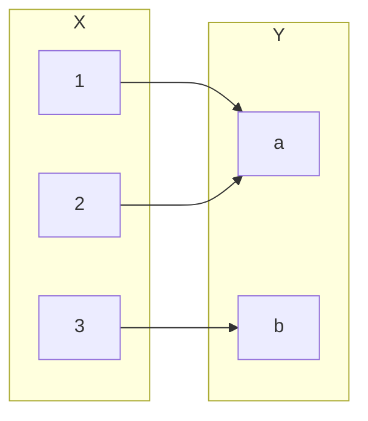
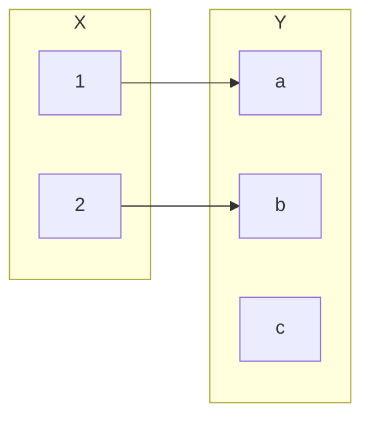

# Basics of Counting

We develop the intuition behind the basic counting principles here. We start with unrestricted permutations and work up to combinations and permutations subject to certain symmetries.

## Permutation

We can think of a permutation of a sequence $n$ as a particular ordering of its elements. We consider each ordering to be a unique object.

> [!example]
> Consider the string $S = \text{abc}$. Then the permutations of $S$ are as follows:
> $$
> \{ abc, acb, bac, bca, cab, cba \}
> $$
> which we obtain by **permuting** the elements of $S$.

When we consider the number of permutations of a given set, we consider a sequence of choices with respect to the number of remaining elements in our set. In our example, we had 3 choices for the first letter, 2 for the second and 1 for the final letter. By the multiplication rule, we see the number of permutations of $S$ is $3 \cdot 2 \cdot 1 = 6$

> [!info] Permutations of a $n$-element set
> Suppose $S$ is a finite set of $n$ elements. Then the number of permutations of $S$ is given by:
> $$
> n! = (n)(n-1)(n-2)\dots(2)(1)
> $$

### K-Permutations

Often times we want to compute the number of permutations of size $k$ from a given element. This follows by similar argument to the number of permutations of size $n$ with the restriction that we make $k$ choices instead of $n$

> [!example]
> Suppose $S = \text{abc}$ and $k = 2$. Then the permutations of size $k$ of $S$ are:
> $$
> \{ ab, ba, ac, ca, bc, cb \}
> $$

As mentioned, the general form for $k$-permutations can be thought of as a sequence of $k$ choices made from  $n$ elements:

> [!info] $k$-Permutations of an $n$-element set
> Suppose $S$ is a set of $n$ elements and $k$ is a nonnegative integer such that $k \leqslant n$. Then the number of $k$-permutations of $S$ is given by:
> $$
> \frac {n!} {(n-k)!} = (n)(n-1)(n-2)\dots(n-k+1)
> $$

## Functions

When we consider the number of functions from a domain $X$ to its co-domain $Y$, we reduce the problem to a sequence of decisions under certain restrictions.

### Total Functions

Consider the digraph of a function $f$ from $X \to Y$ below:

When considering the number of functions from $X \to Y$, we again formulate the problem as a sequence of choices for each element in $X$. Because a function is well-defined if every element in its domain is mapped to one and only one element in its co-domain, we have no restrictions on the number of choices at each step of the sequence.

> [!example]
> The number of functions from $X = \{ 1, 2, 3 \} \to Y = \{ a,  b \}$ is computed by considering the choices for each element in the domain:
> $$
> \begin{align}
> &f(1) = \text{a or b} = \text{2 choices} \\ \\
> &f(2) = \text{a or b} = \text{2 choices} \\ \\
> &f(3) = \text{a or b} = \text{2 choices} \\ \\
> \end{align}
> $$
> Thus, because the choices for each element in the domain are independent, we may use the product rule to compute $2^3 = 8$ functions from $X \to Y$.

From this we derive a compact formula:

> [!info] Number of functions between two Sets
> Suppose $X, Y$ are two finite sets. Then the number of functions from $X \to Y$ is given by:
> $$
> |Y|^{|X|}
> $$

### Injective Functions

Unlike the number of total functions, the number of injections is governed by the restriction that each choice must be unique. Moreover, if $|X| > |Y|$, there are no injections from $|X| \to |Y|$ (since by the pigeonhole principle, some $y \in Y$ would be mapped to by at least two elements in $X$.)

> [!example]
> The number of injections from $X = \{ 1, 2 \} \to Y = \{ a,  b, c \}$ is computed by considering the choices for each element in the domain:
> $$
> \begin{align}
> &f(1) = \text{a or b} = \text{3 choices} \\ \\
> &f(2) = \text{a or b} = \text{2 choices} \\ \\
> \end{align}
> $$
>
> We see that this number is the same as the number of **2-permutations** of a 3-element set
> $$
> 3 \cdot 2 = \frac {3!} {(3-2)!} = 6
> $$

We can see generality of the $k$-permutation formula as it applies to the number of injections between two sets.

> [!info] Injections between two Sets
> Suppose $X, Y$ are finite sets and $|X| \geqslant |Y|$. Then the number of injections from $X \to Y$ is given by
> $$
> \frac {|Y|!} {(|Y| - |X|)!}
> $$

### Surjective Functions

> [!todo]
> Find whatever black magic describes this

## Combinations

To develop the intuition behind combinations, we consider forming partitions (based on [[Relations#Equivalence Relations]]) over the set of $k$-permutations of a given set $S$.

## Pascal's Identity