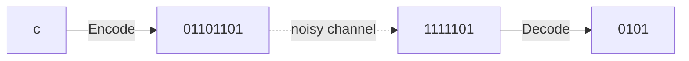

# Hamming Code

In the olden days, computers sending signals over a long distance were subject to interference which may corrupt an incoming message. Computers were able to detect these errors, but Richard Hamming wanted to devise a way to automatically correct them.

We call Hamming codes, "Linear Binary Block Codes" in the modern era.

## Linear Codes

Let $C$ be a set of encodings, and each $c \in C$ be called a _codeword_. $c$ is the codeword to be transmitted, and $\tilde{c}$ is the vector received after transmission over a _noisy channel_.

We write $\tilde{c} = c + e$, where $e$ is a vector with 1s in the error positions. Now suppose we have a matrix $H$ representing hamming codes such that $c$ is in Null $H$. In other words, $H * c = 0$. Using [[Multiplying Matrices and Vectors#Algebraic Properties]], we have:

$$
H * \tilde{c} = H * c + H * e = 0 + H * e = H * e
$$

thus we can determine $H * e$ (called the *error syndrome*) from $H * \tilde{c}$.

## The Hamming Code

The first family of linear codes consisted of 7-vectors such that the column number of matrix $H$ was represented by the binary integer obtained by reading the column:

$$
H =
\begin{bmatrix}
0 & 0 & 0 & 1 & 1 & 1 & 1 \\
0 & 1 & 1 & 0 & 0 & 1 & 1 \\
1 & 0 & 1 & 0 & 1 & 0 & 1
\end{bmatrix}
$$

> [!example]
> Suppose $e = [0, 0, 1, 0, 0, 0, 0]$, then $H * e =$
> $$
> \begin{align}
> &\begin{bmatrix}
> 0 & 0 & 0 & 1 & 1 & 1 & 1 \\
> 0 & 1 & 1 & 0 & 0 & 1 & 1 \\
> 1 & 0 & 1 & 0 & 1 & 0 & 1
> \end{bmatrix} * [0, 0, 1, 0, 0, 0, 0] \\ \\
> &= 0[0, 0, 1] + 0[0, 1, 0] + 1[0, 1, 1] + \dots + 0 \\
> &= [0, 1, 1] = 3 = H_{, 3}
> \end{align}
> $$
>
> Thus we know the error occurred in the 3rd bit, and the recipient can invert it.

We note that this code can only work if $e$ has **at most 1** error.