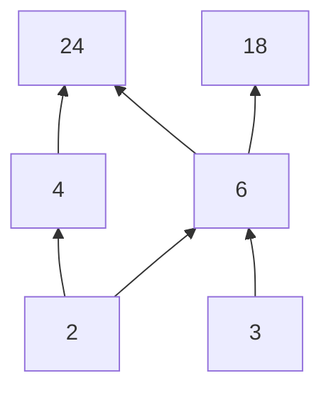

A partial order is a [[Relations|relation]] that enforces some ordering on **comparable** elements. In other words, we want to establish a relation such that, for two elements, either one precedes the other or they are **unrelated**.

> [!info] Partial Order
> A **partial order** $R$ on a set $X$ is a relation that is
> 1. Reflexive
> 2. Transitive
> 3. Antisymmetric
>
> We call $X$ a **partially ordered set** or **poset**. A partial order is often denoted by the generic symbol $\preceq$.

We prove that $\subseteq$ is a partial order.

> [!abstract] Theorem.
> Let $A$ be any set of sets over the universal set $U$. Then $A$ is a poset under $\subseteq$.
>
> Proof.
> Suppose $a \in A$. Then by definition of subset, $a \subseteq a$, and so $\subseteq$ is reflexive. Now suppose $a, b, c \in A$ and further that $a \subseteq b$, $b \subseteq c$. Then by transitivity of $\subseteq$, $a \subseteq c$, and so $\subseteq$ is transitive. Finally, for $a, b \in A$, if $a \subseteq b$ and $b \subseteq a$, then $a = b$ by definition of set equality, and so $\subseteq$ is antisymmetric. Therefore, $\subseteq$ is a partial order, and so $A$ is a poset.
>
> $\blacksquare$

## Comparability

For a given set and partial order $\preceq$, we want to define the concept of two elements being "comparable" under $\preceq$. Elements that are not comparable are unrelated by $\preceq$ (i. e the ordered pair $(a, b) \not \in \preceq$). Additionally, once we have an ordering, we want to define the notion of "greatest" or "least" elements.

> [!info] Comparability
> Given a partial order $\preceq$ over set $A$, we say that $a, b \in A$ are **comparable** if and only if $a \preceq b$ or $b \preceq a$. If $a$ and $b$ are unrelated under $\preceq$, we say $a$ is **"incomparable"** to $b$. Additionally, we define the following terms:
>
> - **maximal**: $a \in A$ is a **maximal** element if $\forall b \in A, b \preceq a$ or $a$ and $b$ are incomparable.
> - **minimal**: $a \in A$ is a **minimal** element if $\forall b \in A, a \preceq b$ or $a$ and $b$ are incomparable.
> - **maximum**: $a \in A$ is **the maximum** element if $\forall b \in A, b \preceq a$
> - **minimum**: $a \in A$ is **the maximum** element if $\forall b \in A, a \preceq b$
>
> A poset may have **at most** minimum/maximum, but must have **at least** one minimal/maximal element.

We establish a lemma showing that if we remove one element from a poset, we still have a poset.

> [!abstract] Lemma
> If $A$ is a poset under partial order $\preceq$, then $A - \{ a \}$ is a poset under partial order $\preceq - \{(b, c) \in \preceq : b = a \; \text{or} \; c = a \}$
>
> Proof.
> Suppose $A$ is a poset under $\preceq$ and define $A' = A - \{a\}$ and $\preceq'$ to be $\preceq - \{ (b, c) \in \preceq : b = a \; \text{or} \; c = a \}$. We must show $\preceq'$ is a partial order.
>
> Suppose $b \in A'$. Then by definition of set subtraction, $b \in A, b \neq a$ and so $b \in \preceq'$. By reflexivity of $\preceq$, $(b, b) \in \preceq'$, and so it is reflexive.
>
> Next, suppose $b, c, d \in A'$ and $b \preceq' c, c \preceq' d$. Then $b, c, d \in A$ by definition of set difference and so $b \preceq c, c \preceq d \implies b \preceq d$ by transitivity. Also, $b \neq a, d \neq a$ by set difference, and so $b \preceq' d$. Hence $\preceq'$ is transitive.
>
> Finally, suppose $b, c \in A'$, $b \preceq' c, c \preceq' d$. Then again by set difference $b, c \in A$ and by antisymmetry of $\preceq$, $b = c$. Thus, $\preceq'$ is antisymmetric, and so the relation is a partial order.
>
> $\blacksquare$

Which we use now to show that a partial order always has at least one maximal element.

> [!abstract] Theorem.
> Suppose $\preceq$ is a partial order over poset $A$. Then $\preceq$ has at least one maximal element.
>
> Proof.
> By induction on $n = |A|$. Suppose $n = 1$. Then $a \in A$ is a maximal element (and also the maximum) since $a \preceq a$ by reflexivity. Hence, $\exists N \geq 1$ such that $A$ has a maximal element.
>
> Now suppose $n = N + 1$ and consider $A' = A - \{ a \}$. By previous theorem $A'$ is a poset and so by inductive hypothesis, there is some element, say $b \in A'$, that is a maximal element. Now we consider the cases of including $a$ in $A'$:
>
> 1. $a \preceq b$. Then $b$ is still a maximal element by definition
> 2. $b \preceq a$. By definition of maximal, $\exists c \in A' : c \preceq b$, and by transitivity $c \preceq a$, and so $a$ is maximal.
> 3. $a$ and $b$ are unrelated. Then the inclusion of $a$ has no effect on $b$ being a maximal element, and so it is still a maximal element.
>
>    Therefore in all cases we have shown $A' \cup {a} = A$ has a maximal element and so by mathematical induction the proposition is true for all finite sets.
>
>    $\blacksquare$

## Topological Sort

A topological sort (top sort) of a partial order is a possible ordering of elements. In other words, we impose a total ordering on comparable subsets and then order the subsets.

> This section was anemic. A much better section can be found in Susanna Epp's book $\heartsuit$. Ironically, this is of huge importance in computing.

> [!info] Topological Sort
> If $X$ is a poset under $\preceq$, then $\preceq'$ is a **topological sort** if $\preceq \subseteq \preceq'$ and $\preceq'$ is a **total order**.
>
> An alternative definition is given by Epp:
>
> > [!info] Compatible Partial Orders
> > Given partial orders $\preceq$, $\preceq'$ on poset $A$, we say $\preceq$ is **compatible** with $\preceq'$ if and only if $\forall a, b \in A$, if $a \preceq b$, then $a \preceq' b$.
>
> > [!info] Topological Sort
> > Given partial orders $\preceq$, $\preceq'$ on poset $A$, we say $\preceq'$ is a  **topological sort** of $\preceq$ if and only if $\preceq'$ is a **total order** compatible with $\preceq$.

### Example

The following example imposes the $|$ relation on a set $A = \{ 2, 3, 4, 6, 18, 24\}$.

A potential topological sort of this relation could be:

$$
\preceq' = \{ 3, 2, 6, 4, 18, 24 \}
$$

which we obtain by repeatedly selecting an (arbitrary) minimal element of the relation and then removing that element from $A$.

> [!todo]
> Produce a topsort algorithm in Python.

## Interesting Proofs

Finding counterexamples to the following propositions was helpful in solidifying several concepts about partial orders and relations.

> [!example] Exercise
> If $R, S$ are antisymmetric over a set $A$, is $R \cup S$?
>
> Counterexample.
> Suppose relations $R, S$ are antisymmetric over a set $A$. Let $R$ be the relation imposed by $\leq$ and $S$ be the $\geq$ relation.  Then $R = \{ (1, 2) \}$ and $S = \{ (2, 1) \}$, so then $R \cup S = \{ (1, 2), (2, 1) \}$. But then $R \cup S$ is not antisymmetric since $1 \neq 2$. $\blacksquare$

> [!example] Exercise
> If $R, S$ are partial orders over a set $A$, is $R \circ S$?
>
> Counterexample.
> Suppose $A = \{ 1, 2, 3 \}$  and let $R =\{ (1,1), (2,2), (3,3), (1,2) \}$, $S = \{ (1,1), (2,2), (3,3), (2,3), (3, 1)\}$ then $R \circ S = \{ (1, 1), (2, 2), (3, 3), (2, 3), (1, 3), (3, 1) \}$, but because $1 \neq 3$, the composition violates antisymmetry, and is therefore not a partial order.
>
> $\blacksquare$